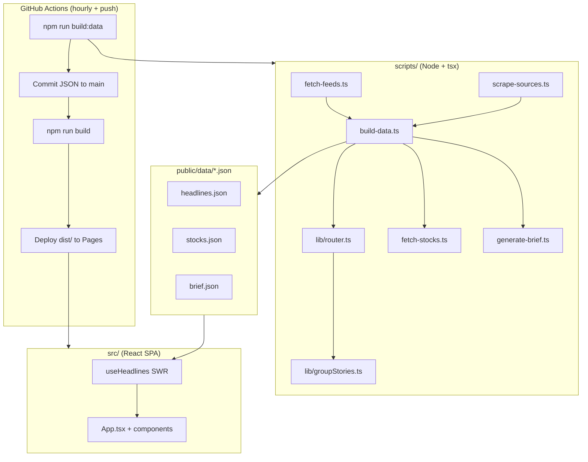
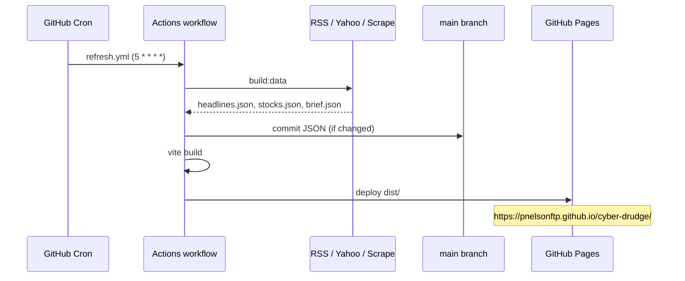

# Architecture & Design Document

**Project:** Cyber Drudge  
**Version:** 1.0.0  
**Last updated:** 2026-06-18

---

## 1. Executive summary

Cyber Drudge is a static, Drudge-Report-style cybersecurity news aggregator. It mirrors the layout and interaction patterns of [AI-Drudge](https://pnelsonftp.github.io/ai-drudge/) while using a Financial Times–inspired blue/orange palette.

The system has two phases:

1. **Build-time data pipeline** — Node.js scripts fetch ~50 RSS feeds, scrape one HTML source, route articles into 18 categories, compute trending clusters and a lead story, fetch stock quotes, and optionally generate an LLM brief. Output is three JSON files.
2. **Client SPA** — A React app loads those JSON files from GitHub Pages. No live RSS, no backend, no WebSocket refresh.

This separation is intentional and non-negotiable: the deployed app must never fetch RSS directly.

---

## 2. High-level system diagram



---

## 3. Data flow

### 3.1 Ingestion

| Source type | Module | Concurrency | Timeout | Retries |
| ----------- | ------ | ----------- | ------- | ------- |
| RSS/Atom | `fetch-feeds.ts` | 8 parallel | 8s | 1 |
| HTML scrape | `scrape-sources.ts` | Sequential | 8s | 1 |
| Yahoo Finance | `fetch-stocks.ts` | Serial + 250ms delay | 8s | 0 |

**Feed processing (`fetch-feeds.ts`):**

- Parses RSS 2.0 and Atom via `fast-xml-parser`
- Rotates User-Agent strings
- Decodes HTML entities in titles/summaries
- Filters GitHub release noise (`/releases/tag/`, `Release vX.Y.Z`)
- Raises XML entity limits to 100,000 for large feeds
- Per-feed `maxItems` cap (default 15)

**Scrape (`scrape-sources.ts`):**

- CrowdStrike blog HTML fallback when RSS is insufficient

### 3.2 Routing (`lib/router.ts`)

Input: flat `Article[]` from all sources.

**Step 1 — Global per-source cap (6)**  
Applied before routing. Prevents one high-volume outlet from dominating the entire site.

**Step 2 — Multi-category placement**  
Each article goes to:

- Its feed's **home category** (from `scripts/sources.ts`)
- Any category whose **keyword rules** match title + summary

**Keyword-agnostic sources** (`r/netsec`, `r/cybersecurity`) skip keyword routing to avoid polluting every section.

**Step 3 — Per-category diversity cap**  
Within each category, cap articles per source (3–5 based on source count).

**Step 4 — Age filter**  
Articles older than **14 days** are dropped from visible sections.

**Step 5 — Scoring and sort**  
Composite score:

```
score = priorityRank × recencyMultiplier
```

| Priority | Rank |
| -------- | ---- |
| critical | 3 |
| high | 2 |
| normal | 1 |

Recency multiplier uses exponential decay with **72-hour half-life**:

```
multiplier = 0.5 ^ (ageHours / 72)
```

Future-dated items (bad feed timestamps) are clamped to `now`.

**Step 6 — Story grouping (`lib/groupStories.ts`)**  
Jaccard similarity ≥ 0.4 on normalized title tokens clusters related coverage. Same scoring applies to pick the representative article per cluster.

**Step 7 — Trending**  
Clusters with **2+ distinct outlets** become trending stories.

**Step 8 — Lead story**  
Highest-scoring grouped article site-wide (after caps and age filter).

### 3.3 Output schema (`headlines.json`)

```typescript
interface HeadlinesPayload {
  generatedAt: number;        // Unix ms
  categories: CategoryBucket[]; // Non-empty only
  trending: TrendingStory[];
  leadStory: GroupedArticle | null;
  feedStats: FeedStat[];        // ok/fail per source
}
```

Each `CategoryBucket` exposes:

- `articles` — visible list (grouped, capped, sorted)
- `articlesAll` — full pool for bookmarks/search

---

## 4. Category and column layout

18 categories in three columns (4 / 8 / 6):

| Column | Categories |
| ------ | ---------- |
| **Left (4)** | BREAKING THREATS, VULNERABILITIES, MALWARE ANALYSIS, THREAT INTELLIGENCE |
| **Center (8)** | DATA BREACHES, PHISHING & FRAUD, CLOUD SECURITY, NETWORK & ENDPOINT, IDENTITY & ACCESS, AI SECURITY, CRYPTO & PQC, ICS/OT SECURITY |
| **Right (6)** | POLICY & REGULATION, VENDOR & PRODUCT NEWS, INCIDENT RESPONSE, BUG BOUNTY & RESEARCH, SECURITY TOOLS, OFFENSE / RED TEAM |

**Layout change (2026-06-18):** DATA BREACHES and PHISHING & FRAUD moved from left to center for visual balance.

**Primary edit surface:** `scripts/sources.ts` — `CATEGORIES`, `FEEDS`, `KEYWORDS`, `STOCK_TICKERS`.

---

## 5. Client architecture

### 5.1 Stack

| Layer | Technology |
| ----- | ---------- |
| Framework | React 19 |
| Build | Vite 6 (`base: "/cyber-drudge/"`) |
| Styling | Tailwind CSS v4 + custom CSS variables in `src/styles.css` |
| State | React hooks + `localStorage` (bookmarks, queue, mutes, theme) |
| Data loading | `useHeadlines` — fetch JSON + sessionStorage SWR cache |

### 5.2 Views

| View | Behavior |
| ---- | -------- |
| **Home** | 3-column grid, lead story, trending, daily brief, stock ticker |
| **Bookmarks** | Saved article IDs from `localStorage` |
| **Queue** | Read-later list |

### 5.3 UI features

- **Search** — filters visible articles by title/summary/source
- **Hover card** — summary preview on link hover (fixed dark-mode background in v1.0.1)
- **Source pills** — outlet name badges (AI-Drudge pattern)
- **Related badges** — “+N related” for grouped stories
- **Theme** — light / dark / system via CSS variables
- **Mute manager** — hide sources or entire categories

### 5.4 Design system (FT + AI-Drudge)

Inspired by [AI-Drudge](https://pnelsonftp.github.io/ai-drudge/) layout with FT Portfolios palette:

| Token | Light | Dark |
| ----- | ----- | ---- |
| Background | Cream `#FFF1E5` | Navy `#0D1B2A` |
| Accent | FT orange `#F2A900` | Same |
| Link / brand | FT blue `#0055A4` | Lighter blue variant |
| Section headings | Red underline bar | Red underline bar |
| Ticker bar | Black background, mono font | Same |

**Section headings:** uppercase labels with red bottom border (`.section-heading`).

**Masthead:** monospace site title, compact nav.

---

## 6. Deployment architecture



**Workflow:** `.github/workflows/refresh.yml`

- Triggers: cron `5 * * * *`, push to `main`, `workflow_dispatch`
- Concurrency group `refresh-deploy` (cancel in-flight)
- Node 20, `npm ci`, `npm run build:data`, commit JSON, `npm run build`, deploy Pages

**Graceful degradation:**

- Zero articles from fetch → keep previous `headlines.json`, exit 0
- Stock fetch failure → write `{}`
- Brief failure → curated fallback brief

---

## 7. Stock ticker subsystem

**Tickers:** `CRWD`, `PANW`, `S`, `FTNT`, `ZS`, `OKTA`, `SNET`

**Provider:** Yahoo Finance Chart API only (Stooq removed after 404 responses caused all `change: 0`).

**Change calculation:**

```
change = ((price - chartPreviousClose) / chartPreviousClose) × 100
```

Serial requests with 250ms delay to reduce rate-limit risk.

---

## 8. Daily brief subsystem

**Module:** `scripts/generate-brief.ts`

| Mode | Condition |
| ---- | --------- |
| LLM | `ANTHROPIC_API_KEY` set in CI |
| Curated fallback | No key or API error |

Brief is a short markdown-ish summary shown in the center column.

---

## 9. File map

```
cyber-drudge/
├── .github/workflows/refresh.yml   # CI/CD
├── docs/                           # This documentation set
├── public/data/                    # Generated JSON (committed by cron)
├── scripts/
│   ├── sources.ts                  # ★ Primary config
│   ├── build-data.ts               # Orchestrator
│   ├── fetch-feeds.ts
│   ├── fetch-stocks.ts
│   ├── scrape-sources.ts
│   ├── generate-brief.ts
│   ├── types.ts
│   └── lib/
│       ├── router.ts               # Routing + scoring
│       ├── groupStories.ts         # Jaccard clustering
│       └── timeAgo.ts              # Date parsing
├── src/
│   ├── App.tsx                     # Layout + views
│   ├── styles.css                  # Theme tokens
│   ├── components/                 # UI pieces
│   ├── hooks/                      # Data + theme + localStorage
│   └── lib/types.ts                # Client types (mirrors scripts)
├── vite.config.ts                  # base path for GitHub Pages
└── package.json
```

---

## 10. Quality gates (manual / local)

| Check | Command / method |
| ----- | ---------------- |
| TypeScript | `npx tsc --noEmit` |
| Production build | `npm run build` |
| Data rebuild | `npm run build:data` |
| Entity leaks | Grep headlines for `&amp;`, `&#` |
| Per-source cap | Assert ≤6 unique URLs per source site-wide |
| Bundle budget | ~72 KB gzipped (excl. JSON) |

---

## 11. Design decisions log

| Decision | Rationale |
| -------- | --------- |
| Build-time-only RSS | Avoid CORS, rate limits, and client complexity; matches AI-Drudge model |
| Global source cap 6 | Prevent Krebs/CISA/etc. from filling every column |
| Time-decay ranking | Cyber news is operational; stale Patch Tuesday must not beat fresh exploits |
| 14-day hard cap | Drudge-style freshness; reduces noise in slow categories |
| Jaccard ≥ 0.4 | Balance between over-merging and missing related coverage |
| Yahoo-only stocks | Stooq 404 broke change%; Yahoo `chartPreviousClose` is reliable |
| FT + AI-Drudge visual merge | Familiar Drudge layout with brand-consistent colors |
| sessionStorage SWR | Fast revisits without re-fetching JSON on every navigation |
| Commit JSON to main | Pages serves static files; cron keeps data fresh without a database |

---

## 12. Threat model (lightweight)

| Risk | Mitigation |
| ---- | ---------- |
| Malicious RSS content | Titles rendered as text; links are `target="_blank"` + `rel="noopener"` |
| XSS via JSON | No `dangerouslySetInnerHTML` on article bodies |
| Secret leakage | API key only in GitHub Secrets |
| Supply chain | Pin lockfile; SBOM in `docs/SBOM.md` |
| Feed outage | Graceful degradation; `feedStats` in payload for monitoring |
