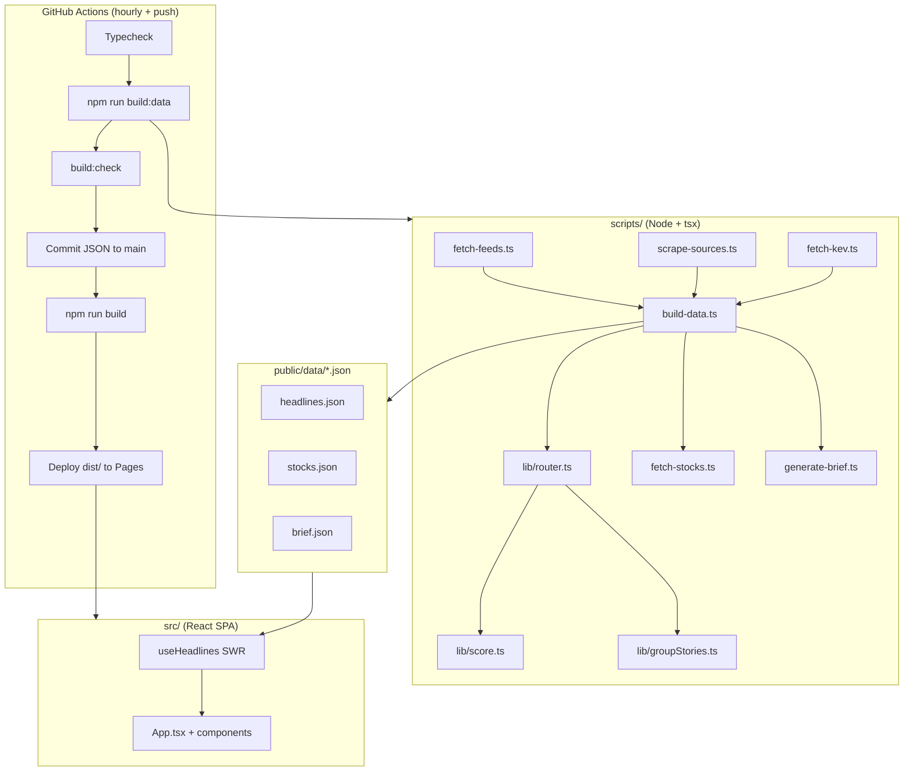

# Architecture & Design Document

**Project:** Cyber Drudge
**Version:** 1.2.0
**Last updated:** 2026-07-07

---

## 1. Executive summary

Cyber Drudge is a static, Drudge-Report-style cybersecurity news aggregator. It mirrors the layout and interaction patterns of [AI-Drudge](https://pnelsonftp.github.io/ai-drudge/) while using a Financial Times–inspired blue/orange palette.

The system has two phases:

1. **Build-time data pipeline** — Node.js scripts fetch 91 RSS/Atom feeds, scrape one HTML source, pull CISA KEV, route articles into 18 categories, compute trending clusters and a lead story, fetch stock quotes, and optionally generate an LLM brief. Output is three JSON files.
2. **Client SPA** — A React app loads those JSON files from GitHub Pages. No live RSS, no backend, no WebSocket refresh.

**The one rule:** The deployed app must never fetch RSS directly.

---

## 2. High-level system diagram



---

## 3. Data flow

### 3.1 Ingestion

| Source type | Module | Concurrency | Timeout | Retries |
| ----------- | ------ | ----------- | ------- | ------- |
| RSS/Atom (91) | `fetch-feeds.ts` | All feeds parallel | 8s incl. body read | 1 (+1s backoff) |
| HTML scrape (1) | `scrape-sources.ts` | Parallel | 8s | 0 |
| CISA KEV JSON | `fetch-kev.ts` | Single fetch | 10s | 0 (fail-soft) |
| Yahoo Finance | `fetch-stocks.ts` | Serial + 250ms delay | 5s | 0 |

**Feed processing (`fetch-feeds.ts`):**

- Parses RSS 2.0 and Atom via `fast-xml-parser` v5, including attribute-bearing
  text nodes (`#text`) and multi-`<link>` Atom entries (prefers `rel="alternate"`)
- Rotates User-Agent strings; supports per-feed extra headers (`FeedDef.headers`)
- The 8s abort timer stays armed **through the body read** — a slow-streaming
  server cannot stall the hourly build
- Decodes HTML entities in titles/summaries
- Rejects non-`http(s)` article URLs at ingest (XSS hygiene)
- Filters GitHub release noise (unless `type: "github-release"`); per-feed
  `maxItems` cap is applied **after** filtering
- **Parser hardening (v1.1):** Rejects bodies that don't start with `<?xml`, `<rss`, or `<feed`
- **`github-release` type:** Synthesizes titles like `nuclei v3.2 released` so pure version tags aren't dropped

### 3.2 Routing (`lib/router.ts`)

Input: flat `Article[]` + optional `kevSet: Set<string>`.

**Step 1 — Clamp future dates**  
CISA and others sometimes publish future timestamps; clamp to `now`.

**Step 2 — KEV tagging + priority elevation**
Extract `CVE-YYYY-NNNNN` from title/snippet; if in KEV set, set `kev: true` and elevate display priority via `elevatePriority()`. (v1.2 fixed a regex bug that had silently disabled this since v1.1.)

**Step 3 — Global per-source cap (6)**
Applied before routing, keeping highest-scoring articles per source.

**Step 4 — Multi-category placement**
Home category + keyword-matched categories. Keywords compile to **word-boundary regexes** (v1.2): whole-word by default, trailing `*` for prefix matching ("encrypt\*"), non-word edge characters as written ("cve-"). Community aggregators (Lobsters, HN, digests) are keyword-agnostic — see `KEYWORD_AGNOSTIC_SOURCES`.

**Step 5 — Per-category age filter**  
Each category has `maxAgeHours` and `softAgeHours` (defined in `scripts/sources.ts`).

**Step 6 — Grouping + scoring**  
Jaccard ≥ 0.4 clustering via `groupStories.ts`; sort by shared `score.ts`.

**Step 7 — Starvation-aware visible fill**
Prefer articles within `softAgeHours`; stale items only top a thin section up to `MIN_VISIBLE` (4) — never fill it to the 12-item brim.

**Step 8 — Trending**
Clusters with 2+ distinct outlets, **only articles ≤ 72h old**.

**Step 9 — Lead story**
Best **fresh** (≤ 96h) grouped article wins regardless of category processing order; the best stale candidate is used only when the whole corpus is stale.

**Scraped-article dates:** listing pages carry no timestamps, so scraped items are stamped at first sight and their `publishedAt` is **carried forward from the previous `headlines.json`** on subsequent runs (v1.2) — they age normally instead of being reborn hourly.

### 3.3 Scoring (`lib/score.ts`) — v1.1

Single source of truth for all ranking:

```
score = (priorityRank + importanceBoost) × recencyMultiplier + relatedBonus
```

| Constant | Value | Meaning |
| -------- | ----- | ------- |
| `HALF_LIFE_HOURS` | 48 | Recency decay half-life (was 72 in v1.0) |
| `TRENDING_MAX_AGE_HOURS` | 72 | Trending eligibility |
| `LEAD_MAX_AGE_HOURS` | 96 | Lead-story preference |
| `MIN_VISIBLE` | 4 | Backfill threshold |
| `MAX_IMPORTANCE_BOOST` | 2.5 | Cap on additive boost |

**Importance signals (regex on title + snippet):** actively exploited, KEV, zero-day, emergency directive, unauth RCE, CVSS 9–10, critical flaw, ransomware, mass-record breaches.

**KEV boost:** +1.5 when article references a CVE in CISA's catalog.

### 3.4 Per-category age windows

| Lane | Categories | softAgeHours | maxAgeHours |
| ---- | ---------- | ------------ | ----------- |
| Fast | breaking_threats, phishing_fraud | 48 | 120 (5d) |
| Standard | incident_response, vulnerabilities, malware, threat_intel, breaches, cloud, network, identity, ai, ics_ot, offense | 96 | 240 (10d) |
| Slow | policy, vendor, bug_bounty, security_tools, crypto_pqc | 168 | 336 (14d) |

(`incident_response` moved to the standard lane in v1.2 — DFIR write-ups
publish days after the intrusion and were being age-dropped.)

### 3.5 Output schema (`headlines.json`)

```typescript
interface HeadlinesPayload {
  generatedAt: number;
  categories: CategoryBucket[];
  trending: TrendingStory[];
  leadStory: GroupedArticle | null;
  feedStats: FeedStat[];
}

interface Article {
  id: string;
  title: string;
  url: string;
  source: string;
  category: CategoryId;
  publishedAt: number;
  snippet?: string;
  priority: Priority;
  kev?: boolean;  // v1.1
}
```

---

## 4. Category and column layout

18 categories in three columns (4 / 8 / 6):

| Column | Categories |
| ------ | ---------- |
| **Left (4)** | BREAKING THREATS, VULNERABILITIES, MALWARE ANALYSIS, THREAT INTELLIGENCE |
| **Center (8)** | DATA BREACHES, PHISHING & FRAUD, CLOUD SECURITY, NETWORK & ENDPOINT, IDENTITY & ACCESS, AI SECURITY, CRYPTO & PQC, ICS/OT SECURITY |
| **Right (6)** | POLICY & REGULATION, VENDOR & PRODUCT NEWS, INCIDENT RESPONSE, BUG BOUNTY & RESEARCH, SECURITY TOOLS, OFFENSE / RED TEAM |

**Primary edit surface:** `scripts/sources.ts`

---

## 5. Client architecture

### 5.1 Stack

| Layer | Technology |
| ----- | ---------- |
| Framework | React 19 |
| Build | Vite 6 (`base: "/cyber-drudge/"`) |
| Styling | Tailwind CSS v4 + CSS variables in `src/styles.css` |
| State | React hooks + `localStorage` / `sessionStorage` |
| Data loading | `useHeadlines` — fetch JSON + sessionStorage SWR |

### 5.2 Views

| View | Behavior |
| ---- | -------- |
| **Home** | 3-column grid, lead story, trending, daily brief, stock ticker |
| **Bookmarks** | Saved article IDs |
| **Queue** | Read-later list |

### 5.3 UI features (v1.1 additions in bold)

- Search, hover card, source pills, related badges
- Theme: light / dark / system
- Mute manager
- **NEW badge** (<6h), **KEV badge**, **opacity de-emphasis** (>72h)
- **Masthead "updated Xm ago"**
- **Lead story UTC timestamp**

### 5.4 Design system

FT Portfolios palette + AI-Drudge layout patterns. See `src/styles.css` for tokens (`.section-heading`, `.source-badge`, `.kev-badge`, `.new-badge`, `.ticker-bar`).

---

## 6. Deployment architecture

**Workflow:** `.github/workflows/refresh.yml`

- Triggers: cron `5 * * * *`, push to `main`, `workflow_dispatch`
- Steps: Checkout → Node 24 → `npm ci` → **typecheck** → **build:data** → **build:check** → commit JSON (rebase-first) → **build** → deploy Pages
- Hardening (v1.2): actions pinned to commit SHAs, 15-minute job timeout, `github-pages` environment, Dependabot for npm + actions

**Graceful degradation:**

- Zero articles → keep previous `headlines.json`
- Stock/brief/KEV failure → empty or fallback; build continues

---

## 7. Quality gates

| Check | Command |
| ----- | ------- |
| TypeScript | `npm run typecheck` |
| Production build | `npm run build` |
| Data rebuild | `npm run build:data` |
| Health report | `npm run build:check` |
| Strict health (CI optional) | `npm run build:check -- --strict` |
| **Live source validation (v1.2)** | `npm run validate:sources` |

`build:check` validates: feed ok/total, per-category diversity, entity leaks, per-source cap (deduped by URL), trending/lead freshness.

`validate:sources` fetches every configured feed, the scrape target, the KEV endpoint, and every stock ticker live — reporting HTTP status, XML validity, item count, and newest-item age (flags zombie feeds >45 days quiet). Run it before and after editing `sources.ts`.

---

## 8. File map

```
cyber-drudge/
├── .github/
│   ├── workflows/refresh.yml       # SHA-pinned actions, Node 24
│   └── dependabot.yml              # v1.2
├── docs/                           # Full documentation set
├── index.html                      # %BASE_URL% placeholders + theme pre-hydration
├── vite.config.ts                  # base path — the ONLY file embedding the repo name
├── scripts/
│   ├── sources.ts                  # ★ Feeds, categories, keywords, age windows
│   ├── build-data.ts               # Orchestrator (+ first-seen date carry-forward)
│   ├── fetch-feeds.ts
│   ├── fetch-kev.ts                # v1.1
│   ├── fetch-stocks.ts
│   ├── scrape-sources.ts
│   ├── generate-brief.ts
│   ├── check-data.ts               # v1.1 health gate
│   ├── validate-sources.ts         # v1.2 live link/feed validator
│   ├── types.ts
│   └── lib/
│       ├── score.ts                # v1.1 shared ranking
│       ├── router.ts               # keyword compilation, KEV tagging, lead/trending
│       ├── groupStories.ts
│       └── timeAgo.ts
├── public/data/                    # Generated JSON (committed by cron)
└── src/
    ├── App.tsx
    ├── styles.css
    ├── components/
    └── hooks/
```

---

## 9. Design decisions log

| Decision | Rationale |
| -------- | --------- |
| Build-time-only RSS | No CORS, rate limits, or client complexity |
| Shared `score.ts` (v1.1) | Prevent router/groupStories drift |
| Per-category age windows (v1.1) | Fast lanes need tighter freshness than policy |
| Starvation-aware fill (v1.1) | Show fewer rather than stale |
| CISA KEV integration (v1.1) | Gold standard for "important right now" |
| `import.meta.env.BASE_URL` for fetches | Portable when `vite.config.ts` base changes |
| Relative `__dirname` in scripts | Portable across directory moves |
| Commit JSON to main | Static hosting without a database |
| Word-boundary keyword compilation (v1.2) | Substring matching misrouted systematically ("apt" → laptop) |
| First-seen dates for scraped items (v1.2) | Listing pages have no timestamps; hourly re-stamping gamed recency |
| http(s)-only links, ingest + render (v1.2) | Feed content is untrusted input |
| Reddit → Lobsters/hnrss (v1.2) | reddit.com blocks GitHub Actions IPs (403/429) |
| KEV JSON = truth, KEV RSS bridge = display (v1.2) | Third-party bridge can die without breaking scoring |

---

## 10. Threat model (lightweight)

| Risk | Mitigation |
| ---- | ---------- |
| Malicious RSS content | Text rendering; `rel="noopener"` on links |
| XSS via JSON | No `dangerouslySetInnerHTML`; article URLs must be `http(s)` at ingest AND at render (v1.2) |
| Secret leakage | API key only in GitHub Secrets |
| Supply chain | Lockfile + actions pinned to commit SHAs + Dependabot (v1.2); SBOM in `docs/SBOM.md` |
| Feed outage | Graceful degradation; `feedStats` + `build:check` + `validate:sources` |
| Slow-loris feed server | Abort timer covers the body read (v1.2) |
